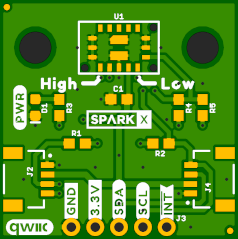
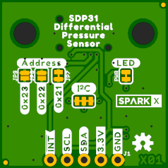

SparkX Differential Pressure Sensor - SDP31 (Qwiic)
===================================================

[*SparkX Differential Pressure Sensor - SDP31 (Qwiic) (SPX-nnnnn)*](https://www.sparkfun.com/products/nnnnn)

The SDP3x sensor family is Sensirion’s series of small differential pressure sensors designed for high-volume applications
where size is a key requirement. It builds on the next generation CMOSens® sensor chip that is at the heart of Sensirion’s
new differential pressure and flow sensing platform.

The digital SDP31 sensor features fast measurement speed, excellent accuracy and long-term stability and has no zero-point
drift. Furthermore, it is reflow solderable and provides extended functionality, such as smart averaging, multiple temperature
compensation modes, configurable I2C address and interrupts.

Able to measure differential pressures in the range +/- 500 Pascals (+/- 0.005 Atm), the SDP31 is ideally suited to air flow rate
and air speed measurement. Need an air speed indicator for your drone or model aircraft? This could be the sensor for you!

Repository Contents
-------------------
* **/Documents** - datasheets etc.
* **/Hardware** - Eagle design files (.brd, .sch)

Documentation
--------------
* **[SDP3X Arduino Library](https://github.com/sparkfun/SparkFun_SDP3x_Arduino_Library)** - Arduino library for the SparkFun Differential Pressure Sensor - SDP31.
* **[Hookup Guide]()** - Basic hookup guide for the SparkX Differential Pressure Sensor - SDP31.

Product Versions
----------------
* [SPX-nnnnn](https://www.sparkfun.com/products/nnnnn) - Original SparkX Release.

License Information
-------------------

This product is _**open source**_!

Please review the LICENSE.md file for license information.

If you have any questions or concerns on licensing, please contact technical support on our [SparkFun forums](https://forum.sparkfun.com/viewforum.php?f=152).

Distributed as-is; no warranty is given.

- Your friends at SparkFun.
